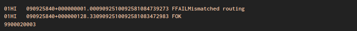
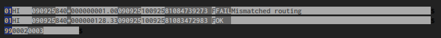

Quick syntax highlighting generator for fixed-width tabular "flat file" formats
---

Before:



After:



This is the result with just a quick definition of field lengths.

Assigning custom colors to fields is also possible.


How to
---

List your fields and their lengths in an [input table](./flap5.table) file.

This project will then generate highlighting rules, currently for:

* Sublime Text
* Vim

Full explanation at [https://www.tspurling.co.uk/fixed-width-highlighting/](https://www.tspurling.co.uk/fixed-width-highlighting/).


```
.
├── *.table
│     Input files -- make more of these to generate more syntax definitions.
│
├── convert
│     Run this to do the conversion.
│
├── lib
│   ├── parse.rb
│   │     Defines the FileInfo, LineType and Field structs; parses input tables.
│   │
│   └── converters
│       ├── sublime.rb
│       └── vim.rb
│
├── sublime
│   ├── user.sublime-color-scheme
│   │     Static file defining basic colors.
│   │
│   └── *.sublime-syntax
│         Generated files for Sublime Text.
│
├── vim-ftdetect
└── vim-syntax
      Equivalent generated files for Vim / Neovim.
```


Other ways
---

Some people prefer using a [hex editor](https://github.com/WerWolv/ImHex)
